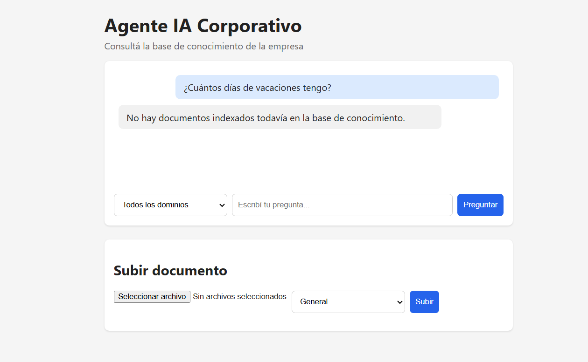
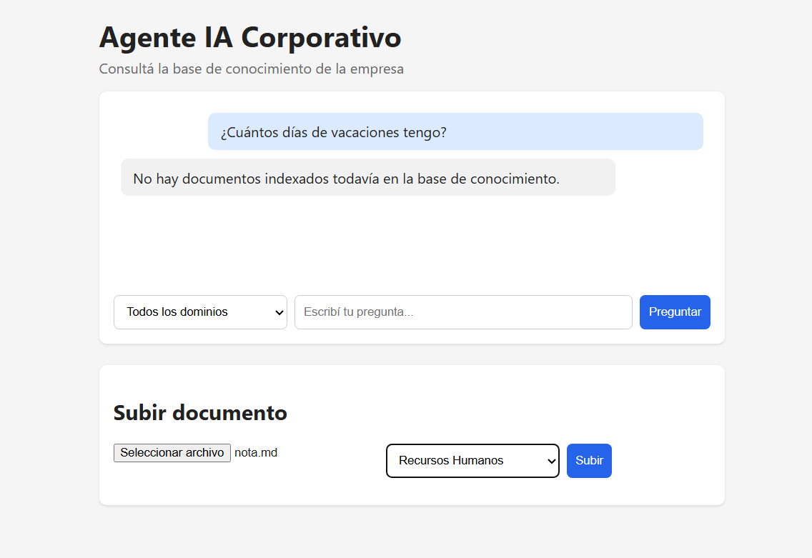
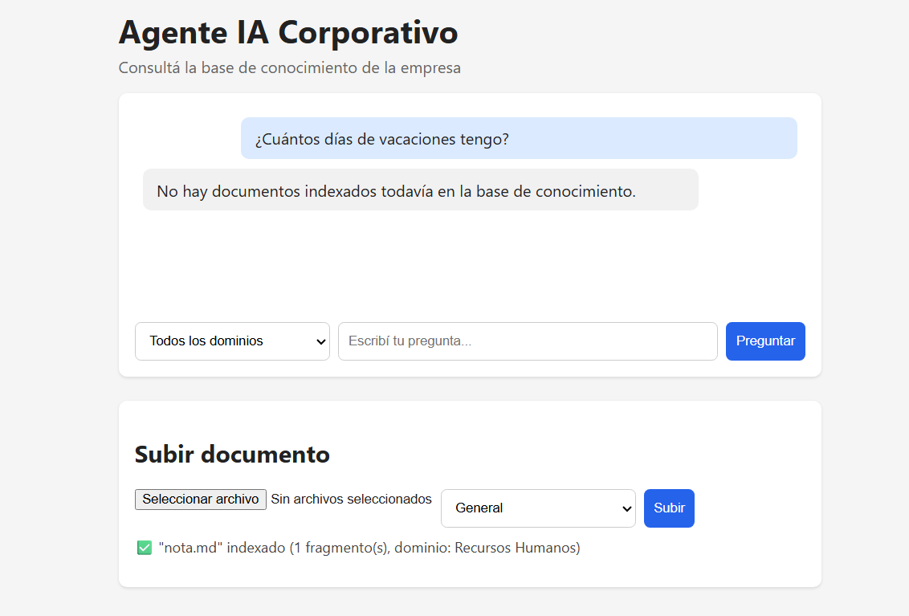
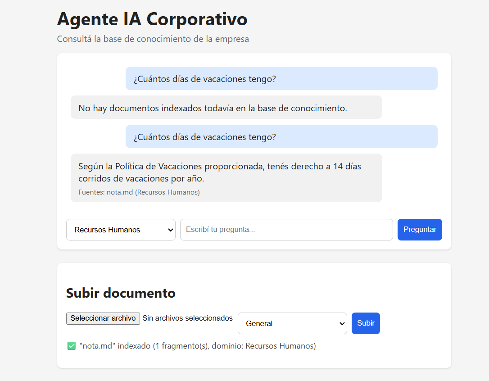

# Agente IA Corporativo

Agente de inteligencia artificial (RAG) que responde preguntas de colaboradores de una empresa en base a documentos internos, cubriendo múltiples formatos de archivo y dominios organizacionales.

Trabajo práctico — Desafío Alura Agentes.

🔗 **Demo desplegada:** [(https://agente-ia-corporativo.onrender.com/)]

## Descripción general

El sistema permite subir documentos internos de la empresa (políticas, manuales, etc.), soportando varias extensiones de archivo (PDF, Word, Excel, Markdown, CSV, JSON y HTML), indexarlos en una base de conocimiento, y luego hacerle preguntas en lenguaje natural. El agente responde citando de qué documento y área (RRHH, Legal, Finanzas, etc.) salió cada dato, sin inventar información que no esté en los documentos cargados.

## Arquitectura de la solución

El proyecto sigue un flujo de tipo **RAG (Retrieval-Augmented Generation)**:

**Al subir un documento:**
Archivo → se extrae el texto → se divide en fragmentos → se genera un embedding de cada fragmento (HuggingFace) → se guarda en la base de conocimiento.

**Al hacer una pregunta:**
Pregunta → se genera su embedding → se buscan los fragmentos más relacionados → se arma un prompt con esa información → un modelo de lenguaje (HuggingFace) genera la respuesta citando las fuentes.

Backend y frontend corren en un único servidor Node/Express.

## Tecnologías y herramientas utilizadas

- **Backend:** Node.js + Express
- **Frontend:** HTML + CSS + JavaScript plano
- **Embeddings y LLM:** HuggingFace Inference API (`paraphrase-multilingual-MiniLM-L12-v2` y `Qwen2.5-7B-Instruct`)
- **Chunking:** LangChain (`RecursiveCharacterTextSplitter`)
- **Parsers de documentos:** `pdf-parse`, `mammoth`, `exceljs`, `cheerio`, `papaparse`
- **Base de conocimiento:** vector store en memoria con persistencia a JSON
- **Formatos soportados:** PDF, Word, Excel, Markdown, CSV, JSON, HTML

## Instrucciones para ejecutar el proyecto

```bash
git clone <url-del-repo>
cd agente-ia-corporativo
npm install
cp .env.example .env
# completar HUGGINGFACE_API_KEY en .env con un token de huggingface.co
npm run dev
```

El proyecto queda disponible en `http://localhost:3000`.

## Ejemplos de preguntas que el agente puede responder

- ¿Cuántos días de vacaciones tengo?
- ¿Cuál es la política de vacaciones?
- ¿Cuáles son todas las políticas de la empresa que conocés?
- ¿Qué se necesita para justificar una licencia médica?

## Ejemplos de respuestas generadas por el agente

**Sin documentos indexados**, el agente avisa que no tiene información:



**Subiendo un documento:**



**Documento subido**, queda indexado con su dominio correspondiente:



**Al preguntar**, el agente responde citando la fuente real:



> Pregunta: *"¿Cuántos días de vacaciones tengo?"*
> Respuesta: *"Según la Política de Vacaciones proporcionada, tenés derecho a 14 días corridos de vacaciones por año."*
> Fuente: `nota.md` (Recursos Humanos)
